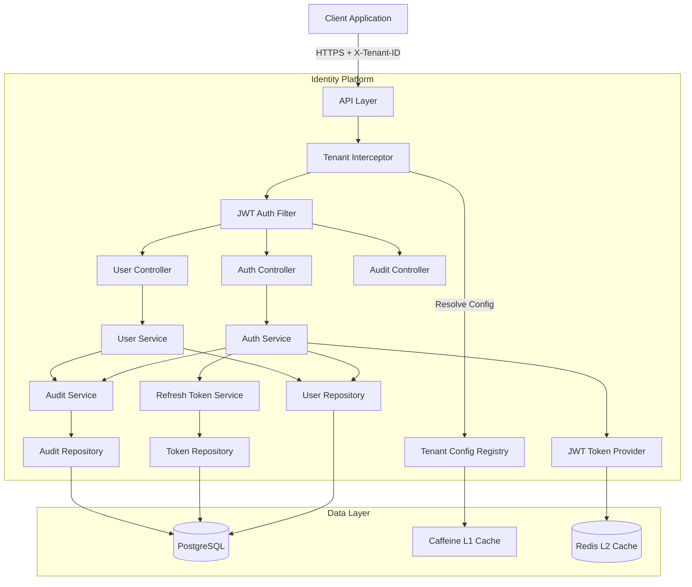
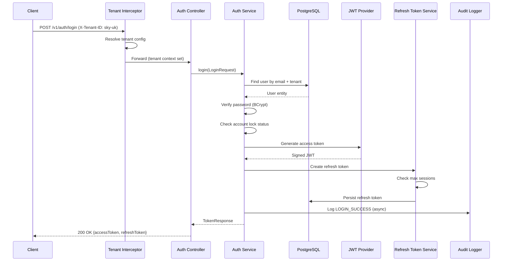
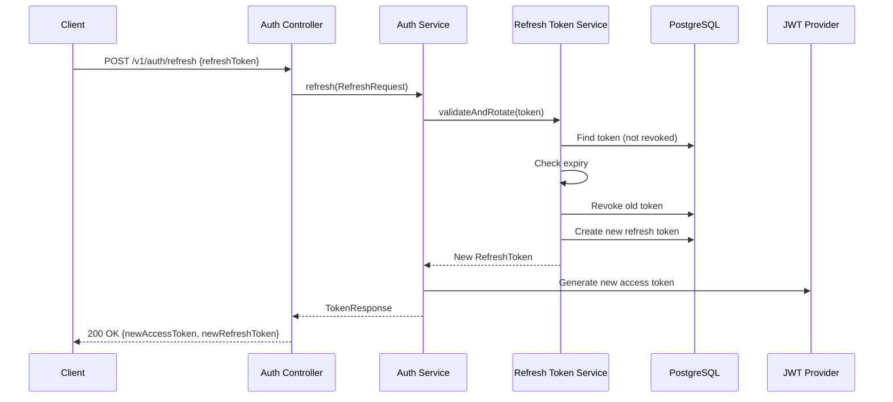
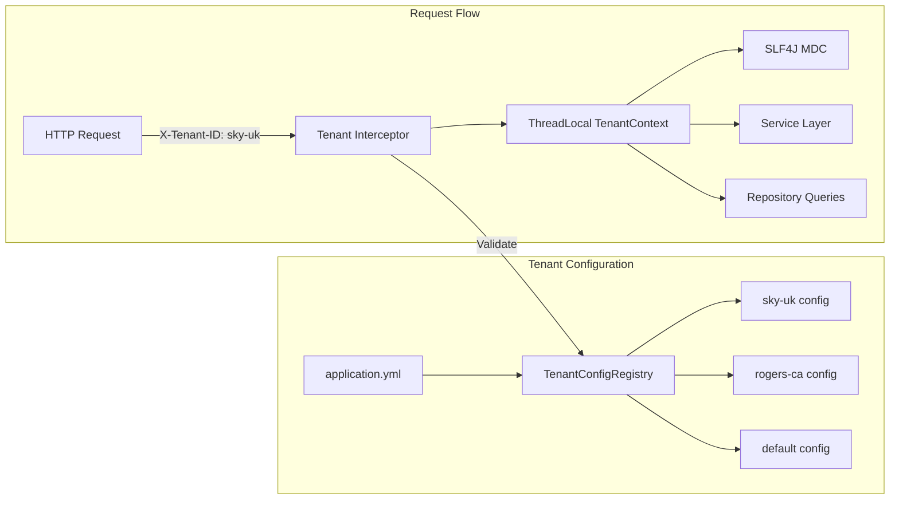
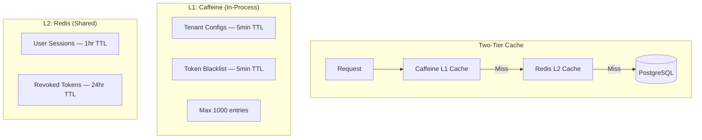
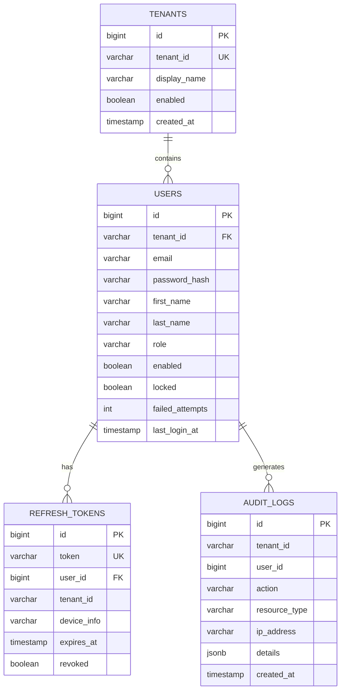

# Architecture

## System Overview

```mermaid
graph TB
    Client[Client Application] -->|HTTPS + X-Tenant-ID| Gateway[API Layer]

    subgraph "Identity Platform"
        Gateway --> TI[Tenant Interceptor]
        TI -->|Resolve Config| TCR[Tenant Config Registry]
        TI --> JWT[JWT Auth Filter]
        JWT --> Auth[Auth Controller]
        JWT --> Users[User Controller]
        JWT --> Audit[Audit Controller]

        Auth --> AS[Auth Service]
        AS --> UP[User Repository]
        AS --> TS[Refresh Token Service]
        AS --> JTP[JWT Token Provider]

        Users --> US[User Service]
        US --> UP

        TS --> TR[Token Repository]

        AS --> AuS[Audit Service]
        US --> AuS
        AuS --> AR[Audit Repository]
    end

    subgraph "Data Layer"
        UP --> PG[(PostgreSQL)]
        TR --> PG
        AR --> PG
        TCR --> Caffeine[Caffeine L1 Cache]
        JTP --> Redis[(Redis L2 Cache)]
    end
```

## Authentication Flow

```mermaid
sequenceDiagram
    participant C as Client
    participant TI as Tenant Interceptor
    participant AC as Auth Controller
    participant AS as Auth Service
    participant DB as PostgreSQL
    participant JWT as JWT Provider
    participant RT as Refresh Token Service
    participant AL as Audit Logger

    C->>TI: POST /v1/auth/login (X-Tenant-ID: sky-uk)
    TI->>TI: Resolve tenant config
    TI->>AC: Forward (tenant context set)
    AC->>AS: login(LoginRequest)
    AS->>DB: Find user by email + tenant
    DB-->>AS: User entity
    AS->>AS: Verify password (BCrypt)
    AS->>AS: Check account lock status
    AS->>JWT: Generate access token
    JWT-->>AS: Signed JWT
    AS->>RT: Create refresh token
    RT->>RT: Check max sessions
    RT->>DB: Persist refresh token
    AS->>AL: Log LOGIN_SUCCESS (async)
    AS-->>AC: TokenResponse
    AC-->>C: 200 OK {accessToken, refreshToken}
```

## Token Refresh with Rotation

```mermaid
sequenceDiagram
    participant C as Client
    participant AC as Auth Controller
    participant AS as Auth Service
    participant RT as Refresh Token Service
    participant DB as PostgreSQL
    participant JWT as JWT Provider

    C->>AC: POST /v1/auth/refresh {refreshToken}
    AC->>AS: refresh(RefreshRequest)
    AS->>RT: validateAndRotate(token)
    RT->>DB: Find token (not revoked)
    RT->>RT: Check expiry
    RT->>DB: Revoke old token
    RT->>DB: Create new refresh token
    RT-->>AS: New RefreshToken
    AS->>JWT: Generate new access token
    AS-->>AC: TokenResponse
    AC-->>C: 200 OK {newAccessToken, newRefreshToken}
```

## Multi-Tenancy Architecture

```mermaid
graph LR
    subgraph "Request Flow"
        R[HTTP Request] -->|X-Tenant-ID: sky-uk| TI[Tenant Interceptor]
        TI --> TC[ThreadLocal TenantContext]
        TC --> MDC[SLF4J MDC]
        TC --> SVC[Service Layer]
        TC --> REPO[Repository Queries]
    end

    subgraph "Tenant Configuration"
        YAML[application.yml] --> TCR[TenantConfigRegistry]
        TCR --> SKY[sky-uk config]
        TCR --> ROG[rogers-ca config]
        TCR --> DEF[default config]
    end

    TI -->|Validate| TCR
```

## Caching Strategy

```mermaid
graph TB
    subgraph "Two-Tier Cache"
        REQ[Request] --> L1[Caffeine L1 Cache]
        L1 -->|Miss| L2[Redis L2 Cache]
        L2 -->|Miss| DB[(PostgreSQL)]
    end

    subgraph "L1: Caffeine (In-Process)"
        L1A[Tenant Configs — 5min TTL]
        L1B[Token Blacklist — 5min TTL]
        L1C[Max 1000 entries]
    end

    subgraph "L2: Redis (Shared)"
        L2A[User Sessions — 1hr TTL]
        L2B[Revoked Tokens — 24hr TTL]
    end
```

## Database Schema

```mermaid
erDiagram
    TENANTS ||--o{ USERS : contains
    USERS ||--o{ REFRESH_TOKENS : has
    USERS ||--o{ AUDIT_LOGS : generates

    TENANTS {
        bigint id PK
        varchar tenant_id UK
        varchar display_name
        boolean enabled
        timestamp created_at
    }

    USERS {
        bigint id PK
        varchar tenant_id FK
        varchar email
        varchar password_hash
        varchar first_name
        varchar last_name
        varchar role
        boolean enabled
        boolean locked
        int failed_attempts
        timestamp last_login_at
    }

    REFRESH_TOKENS {
        bigint id PK
        varchar token UK
        bigint user_id FK
        varchar tenant_id
        varchar device_info
        timestamp expires_at
        boolean revoked
    }

    AUDIT_LOGS {
        bigint id PK
        varchar tenant_id
        bigint user_id
        varchar action
        varchar resource_type
        varchar ip_address
        jsonb details
        timestamp created_at
    }
```
